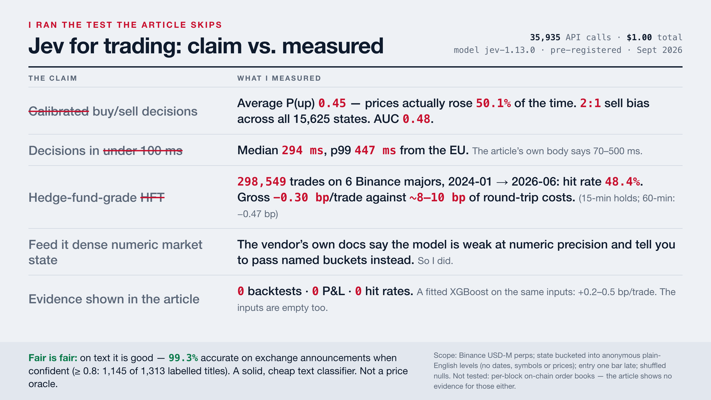

# Jev for trading: claim vs. measured

A post with ~400k views says TypeSafe's **Jev** is the fastest AI model ever built for trading,
makes calibrated buy/sell decisions in under 100 ms, and shows how to build an HFT system on it.
The article behind it contains no backtest, no P&L and no hit rate. So I ran the test.
It cost **$1.00** of API credit. Everything needed to check me is in this repository.



| the claim | what I measured | reproduce with |
|---|---|---|
| Calibrated buy/sell decisions | Mean P(up) **0.45** while price rose **50.1%** of the time. **7,013 SELL vs 3,312 BUY** states out of 15,625 symmetric ones. AUC **0.48** | `04_eval_t3_scalping.py`, `03_enumerate_t3_states.py` |
| Decisions in under 100 ms | Sequential, warm connection from the EU: median **294 ms**, p99 **447 ms**. Under load, 20,060 calls: median 301 ms, **0.00% under 100 ms** | `06_latency_from_cache.py`, `01_probe_latency_determinism.py` |
| Hedge-fund-grade HFT | **298,549 trades**, 6 Binance majors, 2024-01 → 2026-06: hit rate **48.4%**, gross **−0.30 bp/trade** (15 min), −0.47 bp (60 min), against **~8–10 bp** of round-trip costs. Worse than a coin flip, before fees (z = −3.9 vs a time-shift null). Independent replication on freshly rebuilt data: 48.6%, −0.16 bp | `04_eval_t3_scalping.py` |
| Feed it dense numeric state | The vendor's own docs say the model is weak at numeric precision and recommend named buckets. So that is what it was given | `jev/states.py`, `method/METHOD.md` |
| (the inputs) | A fitted XGBoost on the same six features makes between **−0.3 and +0.5 bp/trade** out of sample, depending on the run. The inputs are empty too | `04_eval_t3_scalping.py` |

**Fair is fair.** On text the model is good: **99.3%** accurate on exchange announcement titles when
its confidence is ≥ 0.8 (1,145 of 1,313 labelled titles; 88.2% with no gating), and several of its
"errors" are my regex being wrong. It is a solid, cheap, fast text classifier. It is not a price oracle.

## Verify it in two minutes — no API key needed

Every model response used here is in `data/jev_cache.sqlite` (20,060 responses), keyed by a hash of
the exact request. The scripts read the cache and make **zero API calls**.

```bash
git clone https://github.com/Siim/jev-claim-vs-measured && cd jev-claim-vs-measured
pip install -r requirements.txt
python 03_enumerate_t3_states.py   # rebuilds the model's full 15,625-row decision table from the cache
python 04_eval_t3_scalping.py      # the scalping test: hit rate, bp/trade, AUC, null, XGBoost ceiling
python 05_t4_text_triage.py        # the text test: 99.3% at confidence >= 0.8
python 06_latency_from_cache.py    # latency of all 20,060 recorded calls
```

Expected output of each script is in `results/`.

## Don't trust my cache? Re-price it yourself (~$0.56)

Delete `data/jev_cache.sqlite`, set `TYPESAFE_API_KEY`, and run 03 and 05 again. The model is not
deterministic (identical requests differ by about ±0.02), so your table will differ in the second
decimal and your trade count by a little; the conclusions will not. `01_probe_latency_determinism.py`
measures latency and determinism from your own location for about a cent.

## Don't trust my market data? Rebuild it from Binance and re-run the test

```bash
python 02_build_t3_from_binance.py          # streams ~170 MB from data.binance.vision, 10-20 min, no key
python 04_eval_t3_scalping.py --rebuilt     # the same test on the inputs you just built
```

| | primary run (shipped inputs) | replication (rebuilt from the archive, 2026-09-21) |
|---|---|---|
| trades | 298,549 | 298,437 |
| hit rate, 15 min | **48.37%** | **48.58%** |
| gross bp/trade, 15 min / 60 min | **−0.30 / −0.47** | **−0.16 / −0.32** |
| AUC of P(up 15m) | 0.4805 | 0.4825 |
| z vs time-shift null, 15 min | −3.88 | −2.15 |
| fitted XGBoost ceiling, 15 / 60 min | +0.18 / +0.53 bp | −0.31 / −0.27 bp |
| cost floor | ~8.4–10.5 bp | ~8.4–10.5 bp |

**A data wrinkle, reported rather than hidden.** The shipped inputs were built from the archive as
downloaded on 2026-07-29, before the test was designed. Binance has since *relabelled* the timestamps
of rows from about April 2025 onward by −5 minutes (identical values, moved labels; every column moves
together, so features and outcomes stay aligned with each other). Script 02 demonstrates this from
public data alone: **99.99% of the shipped outcomes and 99.96% of the shipped feature rows are
reproduced** by the rebuild, at the same stamp through 2024 and at the stamp five minutes earlier
afterwards (`results/02_build_t3_from_binance.txt`). A fresh rebuild therefore samples a 15-minute
grid that is one bar off in the later period, which makes the replication an independent draw rather
than a copy. Both runs say the same thing.

## How the test works (short version; details in `method/METHOD.md`)

1. All arithmetic stays in code. Each of six features is reduced to one of five levels and written
   as a plain-English phrase. No dates, symbols or prices are sent, so the model cannot look
   anything up.
2. Six features × five levels = 15,625 possible states. Each was priced once. That table **is** the
   model's trading behaviour on these inputs, and you can read it: with everything neutral it says
   P(up) = 0.42 and "wait"; its one strong rule is "follow aggressive taker flow".
3. A decision every 15 minutes on six liquid perpetuals for 2.5 years; entry **one bar late**;
   frozen rule: act when |P(buy) − P(sell)| ≥ 0.25.
4. Wording, rule, horizons, null and pass bar were fixed before any output met any outcome.
   One wording, one run.

## Scope — what this does and does not show

- It shows that **jev-1.13.0, asked for direction on bucketed market state, has no edge at 15–60
  minute horizons on liquid Binance perpetuals**, and that its probabilities are not calibrated to
  market outcomes (its calibration is for the semantic judgments it was trained on).
- It does **not** test per-block decisions on on-chain order books, which is the venue the article
  points to. The article offers no evidence for those either; the burden is on the claim.
- Prices are a 5-minute mark-price proxy, not fills, and Binance's own relabelling shows the stamps
  are only good to about one bar. With a gross edge that is negative, neither distinction can help the model.
- If the vendor or the author publishes real results on a real venue, I will link them here.

## Files

```
jev/states.py            frozen wording: features, levels, questions
jev/jev_client.py        ~100-line cached client (key only needed on a cache miss)
data/t3_levels.parquet   bucketed features at 523,736 decision stamps
data/t3_outcomes.parquet forward returns (bp), entry one bar late
data/t3_table.parquet    the model's answers for all 15,625 states
data/announcement_titles.parquet, data/t4_triage_labels.parquet   text test
data/jev_cache.sqlite    every model response (hash -> answers, tokens, latency)
results/                 captured output of every script, incl. the replication on rebuilt data
card/                    the image, and its HTML source
```

Not affiliated with TypeSafe or Binance. Model `jev-1.13.0`, September 2026. Not financial advice;
it is the opposite of a recommendation. MIT licence.
